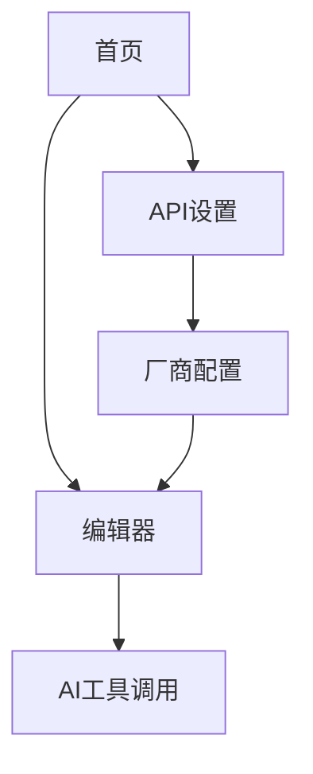

## 1. 产品概述
旺旺是一款本地AI创作工具，通过集成多种AI模型，支持文本、图片、视频、音频等多模态内容生成。采用像素小狗作为图标，为用户提供轻量级的一站式AI创作解决方案。

主要解决创作者在内容制作过程中面临的多工具切换、API配置复杂等问题。目标用户包括内容创作者、设计师、教育工作者等需要快速生成多模态内容的群体。产品定位为免费、本地优先的AI创作助手。

## 2. 核心功能

### 2.1 用户角色
| 角色 | 注册方式 | 核心权限 |
|------|----------|----------|
| 免费用户 | 本地使用，无需注册 | 使用所有基础AI功能，无使用限制 |

### 2.2 功能模块
核心页面包含：
1. **首页**: 工作区导航、最近文件、快速开始。
2. **编辑器页**: 多模态内容编辑、AI工具调用、实时预览。
3. **API设置页**: 四类模型配置、厂商管理、密钥设置。

### 2.3 页面详情
| 页面名称 | 模块名称 | 功能描述 |
|----------|----------|----------|
| 设置页 | 文本模型设置 | 配置文本生成模型厂商、base地址、模型ID列表、API密钥。 |
| 设置页 | 图片模型设置 | 配置图像生成模型厂商、base地址、模型ID列表、API密钥。 |
| 设置页 | 视频模型设置 | 配置视频生成模型厂商、base地址、模型ID列表、API密钥。 |
| 设置页 | 音频模型设置 | 配置音频生成模型厂商、base地址、模型ID列表、API密钥。 |
| 设置页 | 厂商管理 | 添加、编辑、删除各类模型的厂商配置。 |

## 3. 核心流程
### 3.1 创作流程
用户打开旺旺 → 进入首页选择创作类型 → 进入编辑器 → 选择AI工具 → 配置API参数 → 输入创作内容 → 调用AI模型生成 → 本地保存文件

### 3.2 API设置流程
用户进入API设置页 → 选择模型类别 → 添加厂商配置 → 输入base地址、模型ID、API密钥 → 测试连接 → 保存配置

## 4. 用户界面设计

### 4.1 设计风格
- **主色调**：活力橙 (#ff6b35) 搭配纯白背景，体现旺旺的亲和力
- **辅助色**：科技蓝 (#4ecdc4)、温暖黄 (#ffe66d)、自然绿 (#95e1d3)
- **按钮样式**：圆角矩形，主按钮实心，次要按钮描边，悬停有微动效
- **字体**：系统默认字体，标题18px，正文14px，提示12px
- **布局**：简洁的单栏或双栏布局，突出内容创作区域
- **图标**：像素风格图标，与小狗图标保持一致，支持emoji表情

### 4.2 页面设计概览
| 页面名称 | 模块名称 | UI元素 |
|----------|----------|----------|
| 首页 | 导航栏 | 顶部固定，包含旺旺像素小狗图标、新建文件、打开文件按钮 |
| 首页 | 快速开始 | 中央大卡片展示四种创作类型，配像素风格图标和简短描述 |
| 首页 | 最近文件 | 网格布局显示最近使用的文件，显示缩略图和修改时间 |
| 编辑器 | 工具栏 | 顶部工具栏，包含AI工具选择、保存、设置等操作按钮 |
| 编辑器 | 创作区域 | 中央主要内容区域，支持文本输入、图片预览、参数调节 |
| API设置 | 分类标签 | 顶部标签页切换四类模型，每个标签配对应的像素图标 |
| API设置 | 厂商列表 | 卡片式列表展示已配置的厂商，显示名称、模型数量、状态 |
| API设置 | 配置表单 | 弹窗表单，包含base地址输入框、模型ID列表、API密钥输入 |

### 4.3 响应式设计
桌面端优先设计，支持1920×1080及以上分辨率。平板端适配横向布局，手机端提供简化版预览功能。画布操作针对触控板优化，支持双指缩放和智能手势。

### 4.4 动效设计
- 节点连接：贝塞尔曲线动画，数据流动效果
- 组件拖拽：半透明克隆体，吸附对齐提示
- AI生成：卡片脉冲动画，进度环旋转
- 渲染完成：庆祝粒子效果，自动下载提示