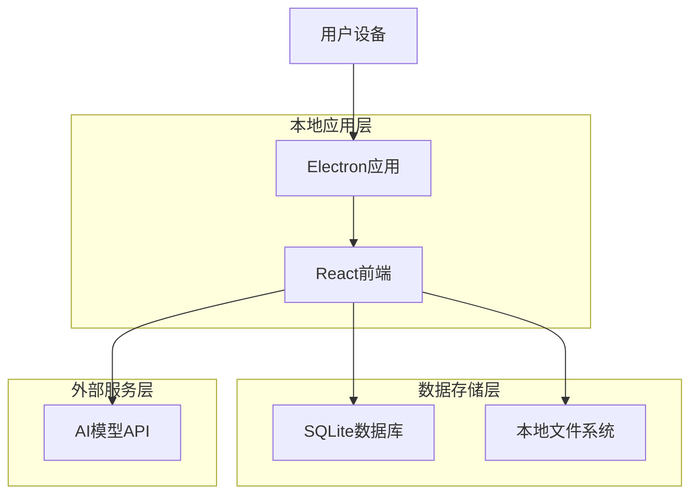
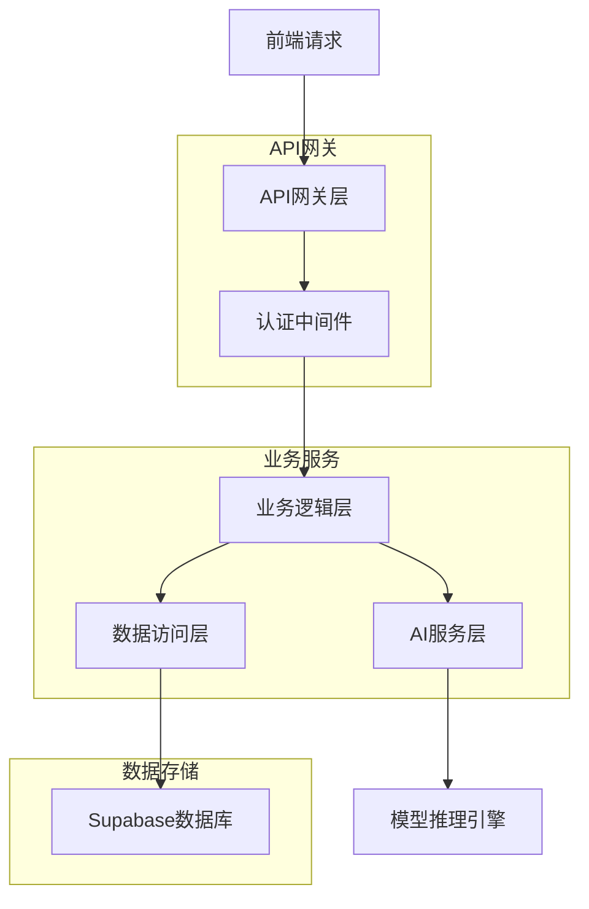
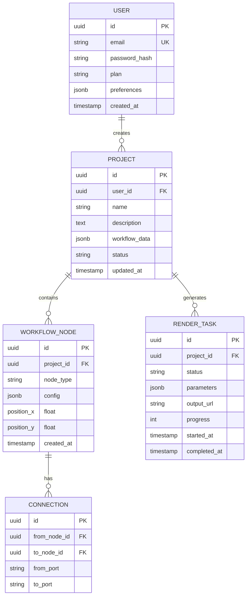

## 1. 架构设计



## 2. 技术栈说明

- **应用框架**: Electron@27 + React@18 + TypeScript
- **构建工具**: Vite + Electron Builder
- **UI框架**: 自定义像素风格组件 + Tailwind CSS
- **状态管理**: Zustand
- **数据库**: SQLite3 + better-sqlite3驱动
- **文件存储**: 本地文件系统 (fs-extra)
- **AI模型调用**: 原生HTTP客户端 (axios)
- **初始化工具**: Vite

## 3. 路由定义

| 路由 | 用途 |
|------|------|
| / | 首页，展示最近文件和快速开始 |
| /editor | 编辑器页面，多模态内容创作 |
| /api-settings | API设置页面，四类模型配置管理 |
| /settings | 通用设置页面，应用偏好配置 |

## 4. 本地API定义

### 4.1 文件操作API
```
GET /api/files/recent
POST /api/files/create
GET /api/files/open
POST /api/files/save
```

### 4.2 AI模型配置API
```
GET /api/models/configs
POST /api/models/configs
PUT /api/models/configs/:id
DELETE /api/models/configs/:id
```

请求参数（模型配置）：
| 参数名 | 类型 | 必需 | 描述 |
|--------|------|------|------|
| category | string | 是 | 模型类别：text/image/video/audio |
| vendor | string | 是 | 厂商名称 |
| baseUrl | string | 是 | API基础地址 |
| modelIds | string[] | 是 | 模型ID列表，第一个为默认 |
| apiKey | string | 是 | API密钥 |

响应：
```json
{
  "id": "config_id",
  "category": "text",
  "vendor": "OpenAI",
  "baseUrl": "https://api.openai.com/v1",
  "modelIds": ["gpt-4", "gpt-3.5-turbo"],
  "isActive": true
}
```

## 5. 服务器架构



## 6. 数据模型

### 6.1 数据模型定义



### 6.2 数据定义语言

**用户表**
```sql
CREATE TABLE users (
    id UUID PRIMARY KEY DEFAULT gen_random_uuid(),
    email VARCHAR(255) UNIQUE NOT NULL,
    password_hash VARCHAR(255) NOT NULL,
    plan VARCHAR(20) DEFAULT 'free' CHECK (plan IN ('free', 'pro', 'team')),
    preferences JSONB DEFAULT '{}',
    created_at TIMESTAMP WITH TIME ZONE DEFAULT NOW(),
    updated_at TIMESTAMP WITH TIME ZONE DEFAULT NOW()
);

-- 创建索引
CREATE INDEX idx_users_email ON users(email);
CREATE INDEX idx_users_plan ON users(plan);
```

**项目表**
```sql
CREATE TABLE projects (
    id UUID PRIMARY KEY DEFAULT gen_random_uuid(),
    user_id UUID NOT NULL REFERENCES users(id) ON DELETE CASCADE,
    name VARCHAR(255) NOT NULL,
    description TEXT,
    workflow_data JSONB DEFAULT '{}',
    status VARCHAR(20) DEFAULT 'draft' CHECK (status IN ('draft', 'running', 'completed', 'failed')),
    created_at TIMESTAMP WITH TIME ZONE DEFAULT NOW(),
    updated_at TIMESTAMP WITH TIME ZONE DEFAULT NOW()
);

-- 创建索引
CREATE INDEX idx_projects_user_id ON projects(user_id);
CREATE INDEX idx_projects_status ON projects(status);
```

**工作流节点表**
```sql
CREATE TABLE workflow_nodes (
    id UUID PRIMARY KEY DEFAULT gen_random_uuid(),
    project_id UUID NOT NULL REFERENCES projects(id) ON DELETE CASCADE,
    node_type VARCHAR(50) NOT NULL CHECK (node_type IN ('input', 'script', 'storyboard', 'video', 'audio')),
    config JSONB DEFAULT '{}',
    position_x FLOAT NOT NULL,
    position_y FLOAT NOT NULL,
    created_at TIMESTAMP WITH TIME ZONE DEFAULT NOW()
);

-- 创建索引
CREATE INDEX idx_workflow_nodes_project_id ON workflow_nodes(project_id);
CREATE INDEX idx_workflow_nodes_type ON workflow_nodes(node_type);
```

**连接关系表**
```sql
CREATE TABLE connections (
    id UUID PRIMARY KEY DEFAULT gen_random_uuid(),
    from_node_id UUID NOT NULL REFERENCES workflow_nodes(id) ON DELETE CASCADE,
    to_node_id UUID NOT NULL REFERENCES workflow_nodes(id) ON DELETE CASCADE,
    from_port VARCHAR(50) DEFAULT 'output',
    to_port VARCHAR(50) DEFAULT 'input',
    created_at TIMESTAMP WITH TIME ZONE DEFAULT NOW()
);

-- 创建索引
CREATE INDEX idx_connections_from_node ON connections(from_node_id);
CREATE INDEX idx_connections_to_node ON connections(to_node_id);
```

**渲染任务表**
```sql
CREATE TABLE render_tasks (
    id UUID PRIMARY KEY DEFAULT gen_random_uuid(),
    project_id UUID NOT NULL REFERENCES projects(id) ON DELETE CASCADE,
    status VARCHAR(20) DEFAULT 'pending' CHECK (status IN ('pending', 'running', 'completed', 'failed')),
    parameters JSONB DEFAULT '{}',
    output_url VARCHAR(500),
    progress INTEGER DEFAULT 0 CHECK (progress >= 0 AND progress <= 100),
    started_at TIMESTAMP WITH TIME ZONE,
    completed_at TIMESTAMP WITH TIME ZONE,
    created_at TIMESTAMP WITH TIME ZONE DEFAULT NOW()
);

-- 创建索引
CREATE INDEX idx_render_tasks_project_id ON render_tasks(project_id);
CREATE INDEX idx_render_tasks_status ON render_tasks(status);
CREATE INDEX idx_render_tasks_created_at ON render_tasks(created_at DESC);
```

**权限设置**
```sql
-- 基础权限设置
GRANT SELECT ON users TO anon;
GRANT ALL PRIVILEGES ON users TO authenticated;

GRANT SELECT ON projects TO anon;
GRANT ALL PRIVILEGES ON projects TO authenticated;

GRANT SELECT ON workflow_nodes TO anon;
GRANT ALL PRIVILEGES ON workflow_nodes TO authenticated;

GRANT SELECT ON connections TO anon;
GRANT ALL PRIVILEGES ON connections TO authenticated;

GRANT SELECT ON render_tasks TO anon;
GRANT ALL PRIVILEGES ON render_tasks TO authenticated;
```