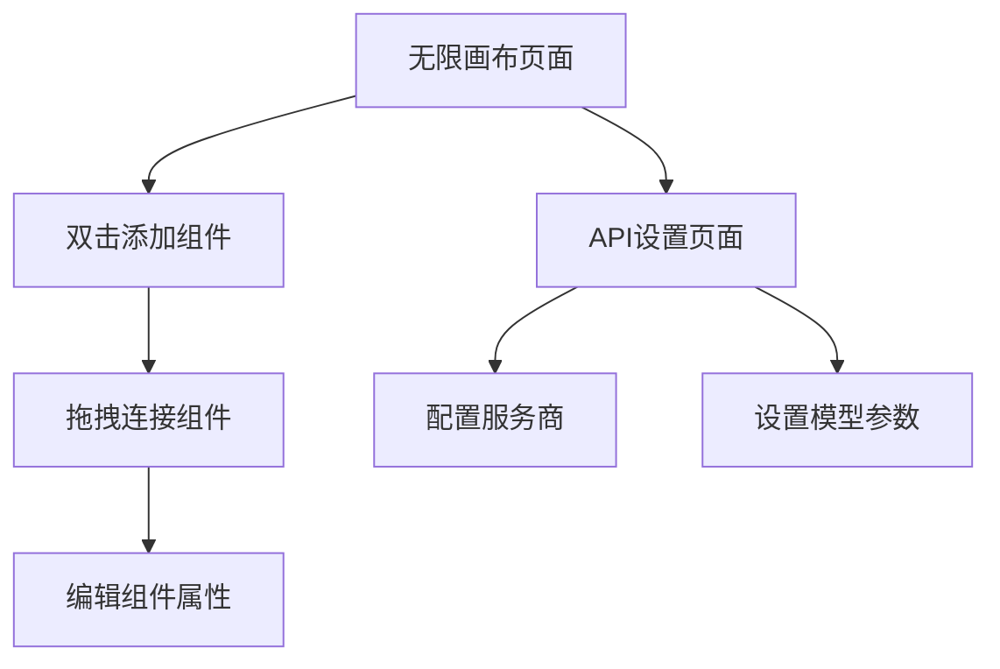

## 1. 产品概述
旺旺是一款基于无限画布的创作工具，用户可以通过双击添加组件并连接它们来创建文本到视频的工作流程。

帮助内容创作者快速构建从文本到脚本的自动化工作流程，提升创作效率。

## 2. 核心功能

### 2.1 用户角色
| 角色 | 注册方式 | 核心权限 |
|------|----------|----------|
| 免费用户 | 本地使用，无需注册 | 使用无限画布、创建和管理工作流程、本地保存项目 |

### 2.2 功能模块
旺旺的核心功能包含以下页面：
1. **无限画布页面**：无限画布、组件添加、连接线、工作流程管理
2. **API设置页面**：文本/图像/视频/音频四类API服务商配置

### 2.3 页面详情
| 页面名称 | 模块名称 | 功能描述 |
|----------|----------|----------|
| 无限画布页面 | 无限画布 | 支持平移和缩放，双击添加组件，拖拽移动组件 |
| 无限画布页面 | 组件系统 | 提供文本、脚本、分镜、视频四种组件类型 |
| 无限画布页面 | 连接线 | 拖拽连接组件，创建数据流向 |
| 无限画布页面 | 组件属性 | 点击组件显示属性面板，编辑参数 |
| API设置页面 | 分类管理 | 按文本/图像/视频/音频四类分别管理 |
| API设置页面 | 服务商配置 | 添加/编辑/删除API服务商 |
| API设置页面 | 模型管理 | 为每个服务商配置多个模型ID，支持设置默认模型 |

## 3. 核心流程
用户打开应用后直接进入无限画布页面，可以双击空白处添加组件，通过拖拽连接组件创建工作流程。点击组件可以编辑属性，在API设置页面配置所需的AI服务商。

## 4. 用户界面设计

### 4.1 设计风格
- **主色调**：深灰色 (#1a1a1a) 背景，突出内容
- **辅助色**：蓝色 (#3b82f6) 用于高亮和交互
- **按钮样式**：圆角矩形，悬停效果
- **字体**：系统默认字体，14-16px主要文字
- **图标风格**：简约线性图标，应用图标使用像素小狗
- **布局风格**：无边框设计，悬浮工具栏

### 4.2 页面设计概览
| 页面名称 | 模块名称 | UI元素 |
|----------|----------|--------|
| 无限画布页面 | 工具栏 | 顶部悬浮工具栏，包含添加组件、缩放控制、设置按钮 |
| 无限画布页面 | 画布区域 | 深色背景，网格辅助线，支持鼠标拖拽平移 |
| 无限画布页面 | 组件节点 | 圆角矩形卡片，不同类型用颜色区分，包含标题和状态图标 |
| 无限画布页面 | 属性面板 | 右侧悬浮面板，显示选中组件的可编辑属性 |
| API设置页面 | 分类标签 | 顶部标签切换文本/图像/视频/音频四类 |
| API设置页面 | 服务商列表 | 卡片式列表显示已配置的服务商 |
| API设置页面 | 配置表单 | 弹窗表单，包含基础URL、API密钥、模型列表输入 |

### 4.3 响应式设计
桌面端优先设计，支持基本的窗口大小调整。主要操作针对鼠标优化，支持触摸板手势。

### 4.4 应用图标
应用图标采用像素风格的小狗形象，体现"旺旺"品牌特色，但UI界面保持现代简约风格。