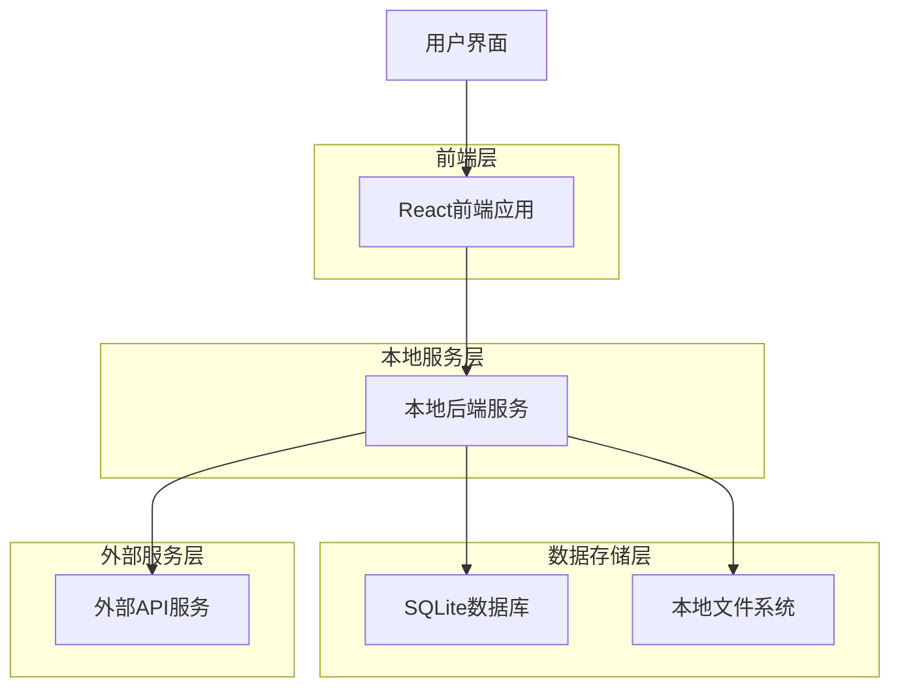
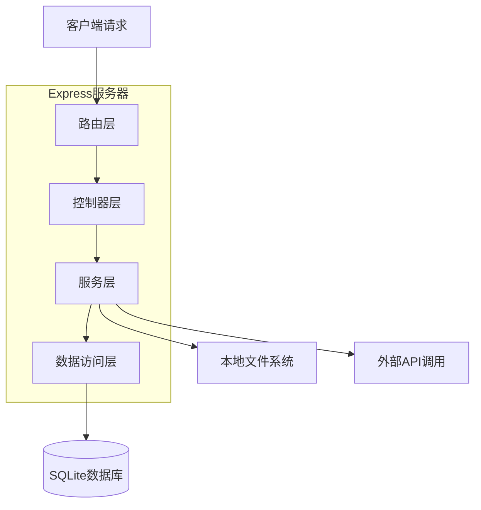
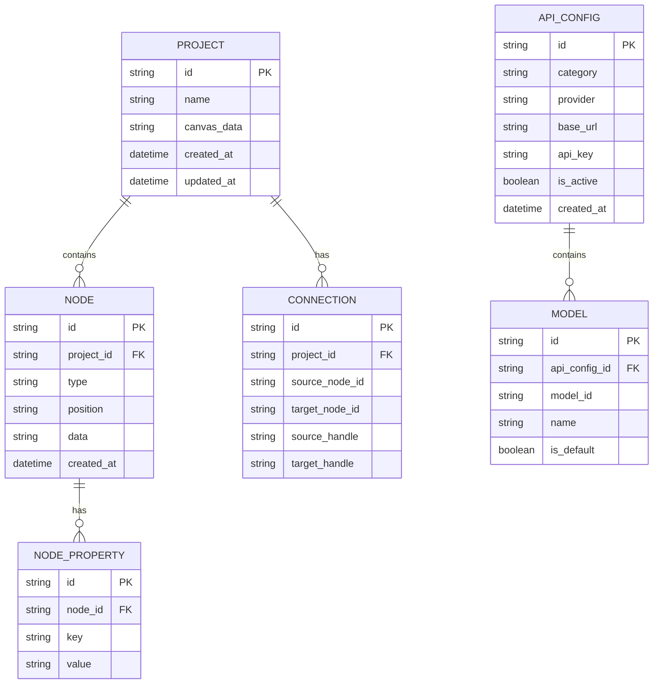

## 1. 架构设计



## 2. 技术栈描述
- 前端：React@18 + TypeScript + TailwindCSS@3 + Vite
- 初始化工具：vite-init
- 后端：Node.js + Express@4 (本地服务)
- 数据库：SQLite (本地数据库)
- 状态管理：Zustand
- 画布引擎：React Flow 或自定义Canvas实现

## 3. 路由定义
| 路由 | 用途 |
|------|------|
| / | 无限画布主页面 |
| /settings | API设置页面 |

## 4. API定义

### 4.1 项目管理API
```
GET /api/projects
```
响应：项目列表

```
POST /api/projects
```
请求：项目名称、画布数据
响应：创建成功状态

```
PUT /api/projects/:id
```
请求：更新后的画布数据
响应：更新成功状态

### 4.2 API配置管理
```
GET /api/settings/apis
```
响应：所有API配置（按类型分类）

```
POST /api/settings/apis
```
请求：API类型、服务商信息、配置参数
响应：创建成功状态

```
PUT /api/settings/apis/:id
```
请求：更新的API配置
响应：更新成功状态

```
DELETE /api/settings/apis/:id
```
响应：删除成功状态

### 4.3 工作流执行API
```
POST /api/workflow/execute
```
请求：工作流节点数据、连接关系
响应：执行状态、结果数据

## 5. 服务器架构图



## 6. 数据模型

### 6.1 实体关系图


### 6.2 数据定义语言

项目表 (projects)
```sql
CREATE TABLE projects (
  id TEXT PRIMARY KEY,
  name TEXT NOT NULL,
  canvas_data TEXT,
  created_at DATETIME DEFAULT CURRENT_TIMESTAMP,
  updated_at DATETIME DEFAULT CURRENT_TIMESTAMP
);
```

节点表 (nodes)
```sql
CREATE TABLE nodes (
  id TEXT PRIMARY KEY,
  project_id TEXT NOT NULL,
  type TEXT NOT NULL,
  position TEXT NOT NULL,
  data TEXT,
  created_at DATETIME DEFAULT CURRENT_TIMESTAMP,
  FOREIGN KEY (project_id) REFERENCES projects(id)
);
```

连接表 (connections)
```sql
CREATE TABLE connections (
  id TEXT PRIMARY KEY,
  project_id TEXT NOT NULL,
  source_node_id TEXT NOT NULL,
  target_node_id TEXT NOT NULL,
  source_handle TEXT,
  target_handle TEXT,
  FOREIGN KEY (project_id) REFERENCES projects(id)
);
```

API配置表 (api_configs)
```sql
CREATE TABLE api_configs (
  id TEXT PRIMARY KEY,
  category TEXT NOT NULL,
  provider TEXT NOT NULL,
  base_url TEXT NOT NULL,
  api_key TEXT NOT NULL,
  is_active BOOLEAN DEFAULT 1,
  created_at DATETIME DEFAULT CURRENT_TIMESTAMP
);
```

模型表 (models)
```sql
CREATE TABLE models (
  id TEXT PRIMARY KEY,
  api_config_id TEXT NOT NULL,
  model_id TEXT NOT NULL,
  name TEXT NOT NULL,
  is_default BOOLEAN DEFAULT 0,
  FOREIGN KEY (api_config_id) REFERENCES api_configs(id)
);
```